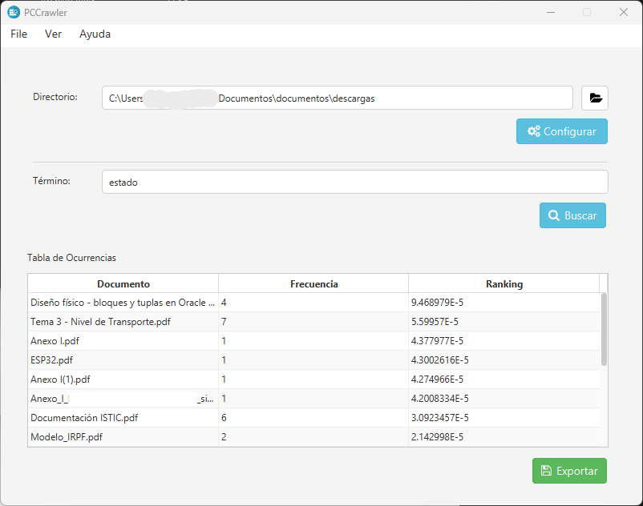

# PCCrawler

PCCrawler es una aplicación de escritorio desarrollada en Java que permite realizar búsquedas locales de términos en ficheros, bajo una configuración previa de diccionario. El sistema fue realizado como proyecto durante el cuarto curso del Grado en Ingeniería Informática, en la asignatura de Recuperación de Información y Búsqueda en la Web.

**Author:** Sergio Fernández Rincón  
**Version:** 1.0  
**Course:** Recuperación de Información y Búsqueda en la Web  
**Degree:** Master's in Computer Engineering  
**University:** University of Extremadura

## Tabla de Contenidos

- [Requisitos](#requisitos)
- [Descarga](#descarga)
- [Instalación](#instalación)
- [Configuración](#configuración)
- [Ejecución](#ejecución)
- [Uso](#uso)
- [Instrucciones de Uso (con imágenes)](#instrucciones-de-uso-con-imagenes)
- [Contribución](#contribución)
- [Estructura del Proyecto](#estructura-del-proyecto)
- [Pasos siguientes](#pasos-siguientes)

---

## Requisitos

- **Java JDK 8** o superior.
- **JavaFX** (si tu JDK no lo incluye).
- **Apache POI** (para exportación a Excel).
- **Apache Tika** (para análisis de ficheros).
- Sistema operativo: Windows (probado en Windows 10 y Windows 11).

Dependencias externas (verifica que los `.jar` estén en tu classpath o configurados en tu IDE):
- `org.apache.tika:tika-core:1.20`
- `tika-app-1.20`
- `poi-4.1.0` y sus módulos (`poi-ooxml`, `poi-ooxml-schemas`, etc.)
- `fontawesomefx-8.9`

## Descarga

1. Haz un **fork** de este repositorio en tu cuenta de GitHub usando el botón "Fork" en la parte superior derecha de la página del repositorio.
2. Clona tu fork a tu equipo:
   ```bash
   git clone https://github.com/tu_usuario/tu_fork.git
   ```
3. Descarga los archivos `.jar` de las dependencias y colócalos en una carpeta accesible.

## Instalación

1. Abre el proyecto en tu IDE favorito.
2. Añade los `.jar` de las dependencias externas al classpath del proyecto.
3. Asegúrate de que el JDK y JavaFX estén correctamente configurados.
4. (Opcional) Configura la variable de entorno `AUTHOR_IMG_PATH` con la ruta absoluta de la imagen del autor para la ventana "About".

## Configuración

1. **Diccionario**: El sistema requiere un diccionario de términos (`Thesaurus_es_ES.txt`) que debe estar en la raíz del proyecto o en la ruta configurada.
2. **Directorios de trabajo**: Al iniciar la aplicación, selecciona el directorio donde se encuentran los ficheros a analizar.
3. **Variables de entorno**:
   - `AUTHOR_IMG_PATH`: Ruta absoluta a la imagen del autor para la ventana "About".

## Ejecución

Puedes ejecutar la aplicación desde tu IDE ejecutando la clase principal:

- **Clase principal**: `com.pc.crawler.Main`

O desde terminal:
```bash
java -cp "ruta/a/tus/libs/*;ruta/a/tu/clases" com.pc.crawler.Main
```

## Uso

1. **Configuración inicial**: Selecciona el directorio de trabajo y configura el diccionario si es la primera vez.
2. **Búsqueda**: Introduce un término en el campo correspondiente y pulsa "Buscar". El sistema mostrará los resultados en una tabla.
3. **Exportación**: Puedes exportar los resultados a un archivo Excel (`.xlsx`) o exportar el diccionario y la FAT a archivos de texto.
4. **Ventanas auxiliares**: Accede a la información del autor, el diccionario o la FAT desde el menú superior.
5. **Recientes**: El sistema guarda los directorios recientes para facilitar búsquedas futuras.

## Instrucciones de Uso (con imágenes)

A continuación se muestran los pasos básicos para utilizar el programa, acompañados de imágenes ilustrativas:

1. **Selecciona el path en donde quieres realizar la búsqueda.**
   - Por ejemplo: `C:/Documents`
   - 

2. **Haz clic en "Configurar"**
   - 

3. **Carga automática del diccionario**
   - El sistema analizará todos los documentos del directorio seleccionado (txt, pdf, doc, etc.) y generará un diccionario con todas las palabras encontradas.
   - 
   - 

4. **Búsqueda de palabras**
   - Escribe una palabra que aparezca en el diccionario y pulsa "Buscar". Verás en qué documentos aparece y cuántas veces, de forma instantánea.
   - 


## Estructura del Proyecto

```
src/
  com/pc/crawler/
    Main.java                # Punto de entrada de la aplicación (JavaFX)
    Crawler.java             # Lógica principal del crawler
    controller/
      MainCtrl.java          # Controlador principal (ventana principal)
      AboutCtrl.java         # Controlador de la ventana "About"
      DiccCtrl.java          # Controlador de la ventana de diccionario
      FatCtrl.java           # Controlador de la ventana FAT
    model/
      Fichero.java           # Modelo de fichero
      Ocurrencia.java        # Modelo de ocurrencia de término
      Ranking.java           # Modelo de ranking de resultados
      helper/
        Labels.java          # Constantes y etiquetas de la interfaz
        ModelTable.java      # Modelo para la tabla de resultados
    resources/
      css/                   # Hojas de estilo
      img/                   # Imágenes (icono, autor, etc.)
      view/                  # Vistas FXML (interfaz gráfica)
Thesaurus_es_ES.txt          # Diccionario de términos
```

## Contribución

¡Las contribuciones son bienvenidas! Para contribuir:

1. Haz un fork del repositorio.
2. Crea una rama para tu funcionalidad o corrección (`git checkout -b mi-nueva-funcionalidad`).
3. Realiza tus cambios y añade comentarios/documentación si es necesario.
4. Haz un commit de tus cambios (`git commit -am 'Añadir nueva funcionalidad'`).
5. Haz push a la rama (`git push origin mi-nueva-funcionalidad`).
6. Abre un Pull Request en GitHub y describe brevemente tu contribución.

---

## Pasos siguientes

Algunas ideas y mejoras futuras para el proyecto:

- **Mostrar las líneas en donde aparecen las ocurrencias dentro del documento.**
- **Poder visitar el documento directamente en la posición de la primera ocurrencia.**
- **Mejoras en el algoritmo de búsqueda y análisis de documentos.**
- **Añadir buscador al diccionario para filtrar palabras rápidamente.**
- **Configurar automáticamente el crawler al introducir una ruta, sin necesidad de pulsar el botón.**
- **Mostrar un proceso de loading o barra de progreso mientras se está configurando el crawler.**
- **Permitir que la búsqueda de términos se realice pulsando la tecla Enter, además del botón.**
- **Soporte para más formatos de archivo y mayor robustez ante errores.**
- **Indexación incremental para grandes volúmenes de datos.**
- **Interfaz gráfica más avanzada y personalizable.**
- **Integración con sistemas de notificaciones o alertas.**
- **Exportación de resultados en más formatos (CSV, JSON, etc.).**
- **Búsqueda avanzada: expresiones regulares, búsqueda por frases, etc.**
- **Soporte multiplataforma (Linux, MacOS).**
- **Documentación y tutoriales en vídeo.**
